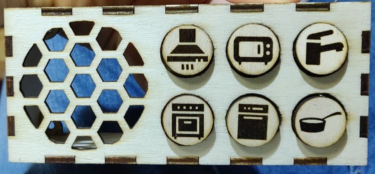

# Soundbox

This was a small project I have done. 
This box plays kitchen sounds and was added to a toy kitchen.
It was done using an Arduino pro mini with 8Mhz and 3.3V and a DFPlayer Mini.
The sounds are loaded from a SD card. Some buttons even have multiple sounds.
To save the battery power the box will go in standby mode with low power consumption.

